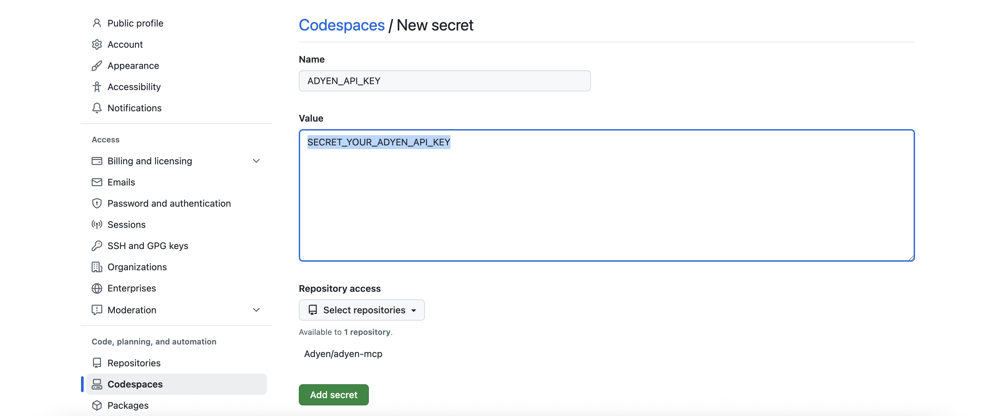
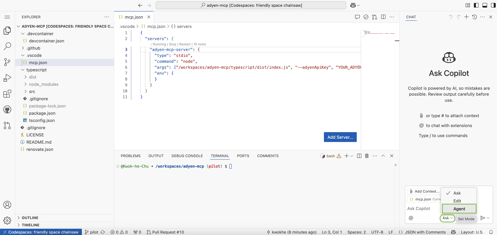

### How to run this on Github Codespaces
1. **Create a new codespace on Github.**


2. **Navigate to `.vscode/mcp.json`**


3. **Replace `{ADYEN_API_KEY}` with your [Adyen API Key](https://docs.adyen.com/development-resources/api-credentials/#generate-api-key)**
**Note:** To run certain functionality (tools) in the mcp-server, you need a webservice user with the following roles: 
* Management API - Accounts Read
* Management API - Payment methods Read
* Checkout Webservice Role
* Merchant PAL Webservice Role

Adyen recommends creating a new webservice user and generating a new API key for the purpose of this application.
Only use the new user’s API key for the MCP application and limit the roles to match the tools you'll be using. 


4. **Click start to run the MCP-server.**


   * **Alternatively**, you may also add your `ADYEN_API_KEY` (TEST) to [Codespaces](https://github.com/settings/codespaces/secrets/new. This securely injects the key into your Codespace environment:

   


5. **Open Github Copilot's chat and set it to `Agent` mode.**
_Note: You may need to enable [Github Copilot](https://github.com/copilot) on your Github account._





6. **Chat with Copilot, here are some example prompts that you could use.**
```
Create a payment link of 42 euros with my merchant account XXX
```


```
List my merchant accounts
```


7. **Press continue to execute the action to confirm**

