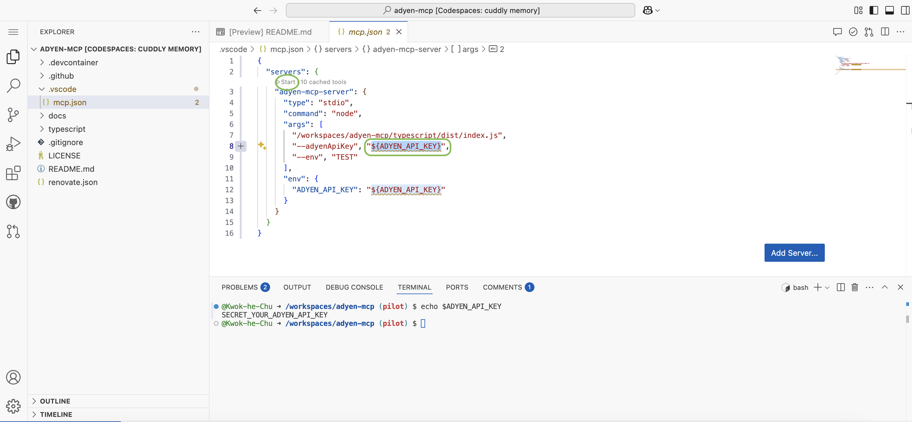

## Adyen MCP Server

The Adyen Model Context Protocol server allows you to integrate with Adyen APIs through LLMs function calling utilizing various Clients.

### Pilot Instructions
0. Open this [survey]()
   - When giving feedback, please keep in mind what the purpose is + (if possible) propose a way forward

1. Create a new codespace on Github 


2. Replace `YOUR_ADYEN_API_KEY` with your [Adyen API Key](https://docs.adyen.com/development-resources/api-credentials/#generate-api-key) in `.vscode/mcp.json` and click start.


**Note:** To run certain tools in the mcp-server, you need a webservice user with the following roles: 
* Management API - Accounts Read
* Management API - Payment methods Read
* Checkout Webservice Role
* Merchant PAL Webservice Role

_Adyen recommends creating a new webservice user and generating a new API key for the purposes of this application._
_Only use the new user’s API key for the MCP application and limit the roles to match the tools you will be using. _


The MCP server should start, see indicator:


3. Open Github Copilot's chat and set it to `Agent` mode


4. Enter some example prompts:
```
Create me a payment link of 42 euros
```

```
List me my merchant accounts.
```

## Create a NEW API KEY and EXPIRE your old API KEY in the Customer Area when you're done with the pilot!

## Fill-in: [this survey]() - Thank you!


### License
MIT license. For more information, see the LICENSE file.

### Support
If you have a feature request, or spotted a bug or a technical problem, create a GitHub issue. For other questions, contact: devrel@adyen.com
